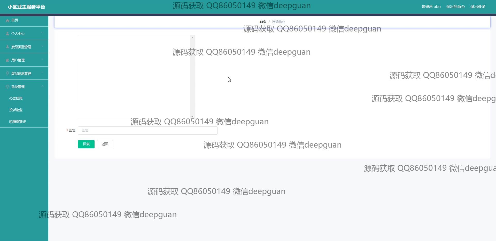

<h1 align="center">小区业主服务平台的设计与实现+vue</h1>

## 简介
小区业主服务平台：功能涵盖废品信息管理、用户管理、投诉处理、公告管理和个人中心，旨在提升社区管理效率与业主体验。    --计算机毕业设计源码；毕设源码；java毕业设计源码

## 联系方式

<h3 align="center">获取完整代码与数据库文件 + 微信：deepguan QQ: 86050149 QQ群: 783742310</h3>

<h3 align="center">可帮忙远程部署 包运行成功！提供远程部署、修改代码、设计文档指导、代码讲解等服务！</h3>

## 功能介绍（完整见运行截图）
管理员： 基本功能包括登录、注册和退出，提供主页导航、轮播图和用户管理功能。支持废品类型及信息管理，公告信息发布与编辑，系统管理与投诉处理。用户信息可查看与修改，并具备权限管理及登录用户状态提示功能。

用户： 基本功能包含登录、注册和退出，主页具备导航、废品信息和公告展示。支持个人信息查看与编辑、废品投诉及管理，并能访问公告信息和个人中心。用户可通过搜索查询废品类别或信息，反馈物业问题，以及管理个人资料。

## 运行截图

本代码来源于网络,仅供学习参考使用!

